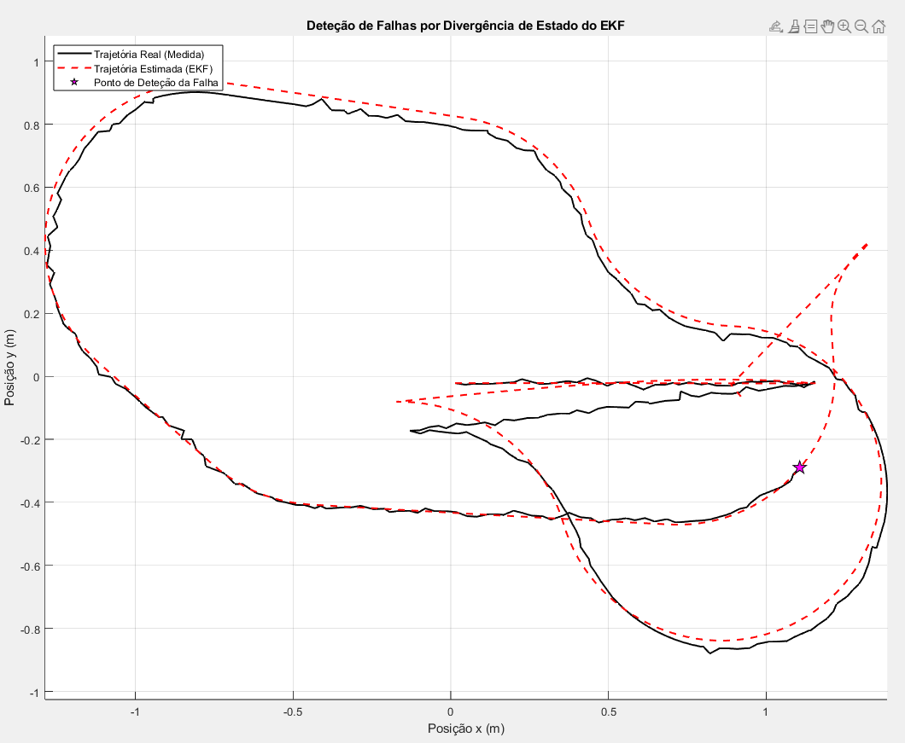

# JetBot: Sensor Fault Detection and Obstacle Avoidance for Robust Navigation

This project presents an intelligent navigation system for the JetBot robot, featuring robust sensor fault detection and advanced obstacle avoidance.

Sensor fault detection is implemented using an Extended Kalman Filter (EKF), which effectively filters noisy sensor data and detects anomalies to ensure reliable navigation.

The navigation control includes a PI controller for trajectory tracking and a Kanayama controller to guide the JetBot to specific target positions after obstacle circumvention. Additionally, optimized path planning techniques are employed to enhance obstacle avoidance performance.

## Project Structure

- **FP_1_EKF_Euclidiana.m**  
  Sensor fault detection using the Kalman Filter (EKF implementation).

- **FP_3_Kanayama_Controller.m**  
  Main project script: implements both PI and Kanayama controllers for robust navigation and obstacle avoidance.

- **goToPoseController.m**  
  Applies the Kanayama controller to guide the JetBot to a specific target position.

- **trajectoryFollowerPI.m**  
  Implements a PI controller for trajectory following.

- **isPathClear.m**  
  Path optimization logic to decide whether to continue obstacle circumvention or resume normal operation.

- **avoidanceController.m**  
  Checks for potential collisions and manages obstacle avoidance behavior.

- **data.mat**  
  Example dataset or simulation data used for testing and validation.

- **JetBotFaultDetectionObstacleAvoidance.pdf**  
  Project documentation and technical report.

  ## Requirements
- MATLAB 

## How to Run
Open the `.m` scripts in MATLAB and execute `FP_3_Kanayama_Controller.m` as the main entry point.
