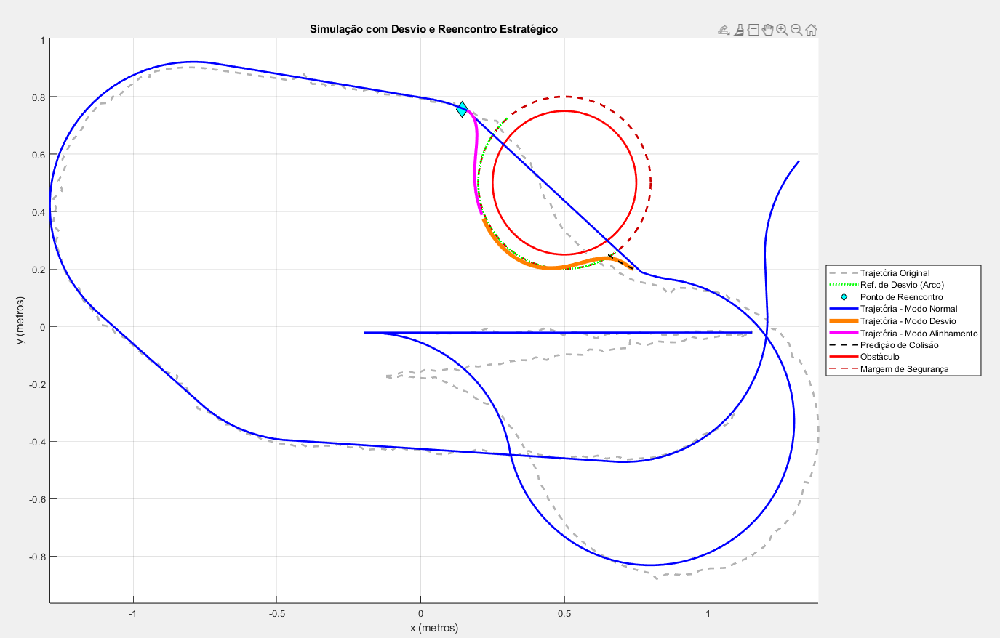

# JetBot-Sensor-Fault-Detection-and-Obstacle-Avoidance-for-Robust-Navigation

Intelligent JetBot navigation with sensor fault detection (Kalman filter) and robust obstacle avoidance.  
Features PI controller for trajectory tracking, Kanayama controller for final position, and optimized path planning.

## Project Structure

- **FP_1_EKF_Euclidiana.m**  
  Sensor fault detection using the Kalman Filter (EKF implementation).

- **FP_3_Kanayama_Controller.m**  
  Main project script: implements both PI and Kanayama controllers for robust navigation and obstacle avoidance.

- **goToPoseController.m**  
  Applies the Kanayama controller to guide the JetBot to a specific target position.

- **trajectoryFollowerPI.m**  
  Implements a PI controller for trajectory following.

- **isPathClear.m**  
  Path optimization logic to decide whether to continue obstacle circumvention or resume normal operation.

- **avoidanceController.m**  
  Checks for potential collisions and manages obstacle avoidance behavior.

- **data.mat**  
  Example dataset or simulation data used for testing and validation.

- **JetBotFaultDetectionObstacleAvoidance.pdf**  
  Project documentation and technical report.

  ## Requirements
- MATLAB 

## How to Run
Open the `.m` scripts in MATLAB and execute `FP_3_Kanayama_Controller.m` as the main entry point.
